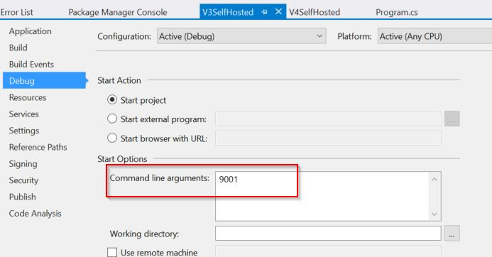

# AspNetKatana-Issue
Repo to host sample demo to showcase issue

# Issue Description:
In AspNetKatana (Microsoft.Owin.dll for .Net framework)  with release of version 4.x , if we pass encoded URL (single, double, triple and so on) is passed to the server , parameters (route or query) recieved at action or at filter are already decoded compared to earlier behavior of 3.x where no decoding was performed.

1. Migrating code from 3.x to 4.x : Url unsafe characters decoding is not backward compatible and if any client is passing double or triple encoded characters in Url, server may interpret those characters differently as expected with 3.x version.
   ```bash
   Target URI:-http://localhost:${Port}/api/values/${Parameter}/${Parameter}?query1=${Parameter}&query2=${Parameter}&query3=${Parameter}

   Encoding count- 2, input: :?#[]@"!$&'()*,;=                                                                                                                                                                                           
   
   Formed URL: http://localhost:9001/api/values/%253A%253F%2523%255B%255D%2540%2522!%2524%2526'()*%252C%253B%253D/%253A%253F%2523%255B%255D%2540%2522!%2524%2526'()*%252C%253B%253D?query1=%253A%253F%2523%255B%255D%2540%2522!%2524%2526'()*%252C%253B%253D&query2=%253A%253F%2523%255B%255D%2540%2522!%2524%2526'()*%252C%253B%253D&query3=%253A%253F%2523%255B%255D%2540%2522!%2524%2526'()*%252C%253B%253D
   
   Json Response from owin v3.x
   
   {"Path1":"%3A%3F%23%5B%5D%40%22!%24%26'()*%2C%3B%3D","DecodedPath1":":?#[]@\"!$&'()*,;=","Path2":"%3A%3F%23%5B%5D%40%22!%24%26'()*%2C%3B%3D","DecodedPath2":":?#[]@\"!$&'()*,;=","Query1":"%3A%3F%23%5B%5D%40%22!%24%26'()*%2C%3B%3D","DecodedQuery1":":?#[]@\"!$&'()*,;=","Query2":"%3A%3F%23%5B%5D%40%22!%24%26'()*%2C%3B%3D","DecodedQuery2":":?#[]@\"!$&'()*,;=","Query3":"%3A%3F%23%5B%5D%40%22!%24%26'()*%2C%3B%3D","DecodedQuery3":":?#[]@\"!$&'()*,;="}
   
   Json Response from owin v4.x 
   
   {"Path1":":?#[]@\"!$&'()*,;=","DecodedPath1":":?#[]@\"!$&'()*,;=","Path2":":?#[]@\"!$&'()*,;=","DecodedPath2":":?#[]@\"!$&'()*,;=","Query1":"%3A%3F%23%5B%5D%40%22!%24%26'()*%2C%3B%3D","DecodedQuery1":":?#[]@\"!$&'()*,;=","Query2":"%3A%3F%23%5B%5D%40%22!%24%26'()*%2C%3B%3D","DecodedQuery2":":?#[]@\"!$&'()*,;=","Query3":"%3A%3F%23%5B%5D%40%22!%24%26'()*%2C%3B%3D","DecodedQuery3":":?#[]@\"!$&'()*,;="}

   ```
2. In 4.x release decoding of Path string parameters (Route parameters) is not in sync with decoding of Query parameters.
   In this case if we have route where encoded parameters are passed in Uri path as well as query parameters , parameters recieved at action has different decoded levels. In case of Path parameters , it is decoded twice , whereas qury parameters are decoded only once. In 3.x releases, we had consistency in decoding of both the parameters. 
    ```bash
   Target URI:-http://localhost:${Port}/api/values/${Parameter}/${Parameter}?query1=${Parameter}&query2=${Parameter}&query3=${Parameter}

   Encoding count- 1, input: :?#[]@"!$&'()*,;= 
   
   Formed URL : http://localhost:9002/api/values/%3A%3F%23%5B%5D%40%22!%24%26'()*%2C%3B%3D/%3A%3F%23%5B%5D%40%22!%24%26'()*%2C%3B%3D?query1=%3A%3F%23%5B%5D%40%22!%24%26'()*%2C%3B%3D&query2=%3A%3F%23%5B%5D%40%22!%24%26'()*%2C%3B%3D&query3=%3A%3F%23%5B%5D%40%22!%24%26'()*%2C%3B%3D
   
   {"Path1":":?#[]@\"!$&'()*,;=","DecodedPath1":":?#[]@\"!$&'()*,;=","Path2":":?#[]@\"!$&'()*,;=","DecodedPath2":":?#[]@\"!$&'()*,;=","Query1":":?#[]@\"!$&'()*,;=","DecodedQuery1":":?#[]@\"!$&'()*,;=","Query2":":?#[]@\"!$&'()*,;=","DecodedQuery2":":?#[]@\"!$&'()*,;=","Query3":":?#[]@\"!$&'()*,;=","DecodedQuery3":":?#[]@\"!$&'()*,;="}                                                                                           ==============================================================================================                                                                                              
   
   Encoding count- 2, input: :?#[]@"!$&'()*,;= 
   
   Formed URL : http://localhost:9002/api/values/%253A%253F%2523%255B%255D%2540%2522!%2524%2526'()*%252C%253B%253D/%253A%253F%2523%255B%255D%2540%2522!%2524%2526'()*%252C%253B%253D?query1=%253A%253F%2523%255B%255D%2540%2522!%2524%2526'()*%252C%253B%253D&query2=%253A%253F%2523%255B%255D%2540%2522!%2524%2526'()*%252C%253B%253D&query3=%253A%253F%2523%255B%255D%2540%2522!%2524%2526'()*%252C%253B%253D

   {"Path1":":?#[]@\"!$&'()*,;=","DecodedPath1":":?#[]@\"!$&'()*,;=","Path2":":?#[]@\"!$&'()*,;=","DecodedPath2":":?#[]@\"!$&'()*,;=","Query1":"%3A%3F%23%5B%5D%40%22!%24%26'()*%2C%3B%3D","DecodedQuery1":":?#[]@\"!$&'()*,;=","Query2":"%3A%3F%23%5B%5D%40%22!%24%26'()*%2C%3B%3D","DecodedQuery2":":?#[]@\"!$&'()*,;=","Query3":"%3A%3F%23%5B%5D%40%22!%24%26'()*%2C%3B%3D","DecodedQuery3":":?#[]@\"!$&'()*,;="}
   ```


# How to use this repo to reproduce the issue:
This repo contains Two folders
1. Server : This folder contains sample solution having two self hosted owin projects.Open solution in visual studio, Open Project property window and save Port as debug argument. If no debug argument is passed it will take 9001 as default port.
    1. V3SelfHosted : This project contains reference to version 3.0.1 of Microsoft.Owin
    2. V4SelfHosted : This project contains reference to version 4.1.0 of Microsoft.Owin
    
2. TestClient : simple client code samples to reproduce the issue
    1. TestCLient.ps1 : Simple poweshell script to test the scenarios , unblock the script, update hosting ports and execute the script
    2. TestClient_Fetch.js : Simple javascript fetch function and call to that method.This can be used in browser's console window. Open swagger of test server , open console window, paste the code ,modify port information and execute the code.

# Reference
1. Update hosting port 
    


